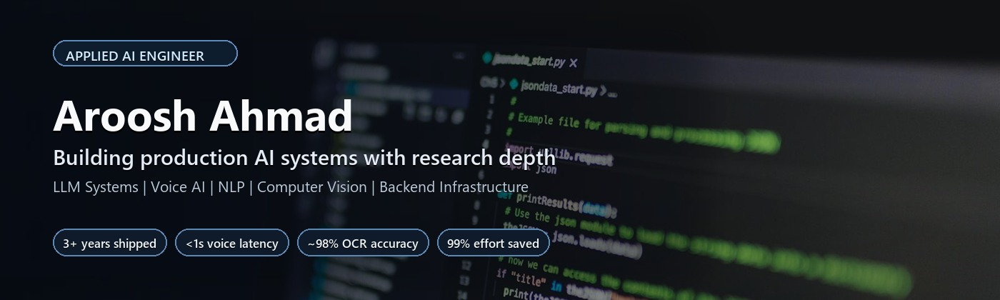

  

  
  
  
  

  
  
  

## 👋 About Me

AI Engineer focused on building **production-grade AI systems** — including LLM-powered applications, voice agents, and OCR pipelines.

I specialize in designing **deterministic + hybrid AI architectures** that reduce hallucination, improve reliability, and scale in real-world environments.

My work combines:
- LLMs + RAG systems
- Voice AI (STT/TTS pipelines)
- Computer Vision (OCR, detection)
- Backend systems (FastAPI, Redis, Docker)

I focus on **shipping systems, not just models**.

## Experience Snapshot

- **Cygnus Payments** - AI / Backend Engineer (`Aug 2025 - Present`)
- **Independent Research** - LLM Research Engineer (`Jan 2025 - Present`)
- **Center of Language Engineering** - AI Research Officer (`Nov 2023 - Feb 2025`)
- **Nodlays** - AI Engineer (`Oct 2022 - Jan 2024`)

## 🚀 Featured Projects

### 🔹 Compass Voice
Real-time AI voice ordering system using Twilio, Deepgram, FastAPI, and Redis.

- Deterministic state machine + NLU pipeline (low hallucination design)
- Real-time audio streaming with sub-second latency (`<1s`)
- Production-oriented architecture (session management, state routing)

---

### 🔹 Urdu OCR Pipeline
CNN-LSTM based OCR + NLP pipeline for Urdu, Arabic, and Farsi.

- Achieved ~98% accuracy with CER reduction (`3.4% → 2.3%`)
- End-to-end pipeline: image → text → structured output
- Handles low-resource language challenges

---

### 🔹 MenuParser AI
OCR + LLM pipeline for structured menu extraction.

- Converts unstructured menus into structured data
- ~99% manual effort reduction
- Combines CV + LLM reasoning

---

### 🔹 LLM Fine-Tuning Research
Instruction fine-tuning with semantic batching (Flan-T5 + LoRA).

- FAISS-based grouping for stable training
- Multi-seed reproducible experiments
- Focus on convergence stability + generalization

## 🧠 Engineering Focus

- Designing reliable AI systems (not just prototypes)
- Reducing hallucination via deterministic pipelines
- Building scalable backend + AI integrations
- Experimentation + research (LLMs, training strategies)

## 🛠 Core Stack

  

**AI / ML:** PyTorch, TensorFlow, Transformers, Hugging Face  
**Backend:** FastAPI, Django, REST APIs  
**Infra:** Docker, Redis, AWS, Azure  
**CV / NLP:** OpenCV, YOLO, PaddleOCR, spaCy  

## Education

- MPhil in Artificial Intelligence, PUCIT (`2024-2026`)
- BS Computer Science, Lahore Garrison University (`2017-2021`)

## 🎯 Current Focus

- Building production-ready LLM and voice AI systems  
- Advancing research in instruction fine-tuning  
- Preparing for high-performance engineering roles (AI/ML systems)
